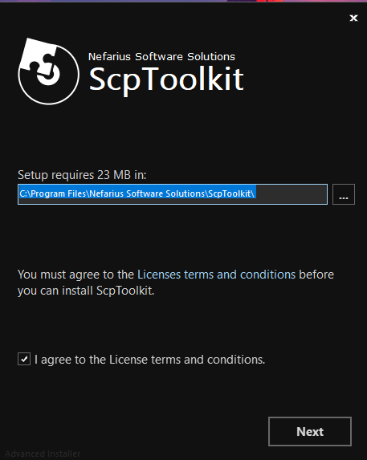
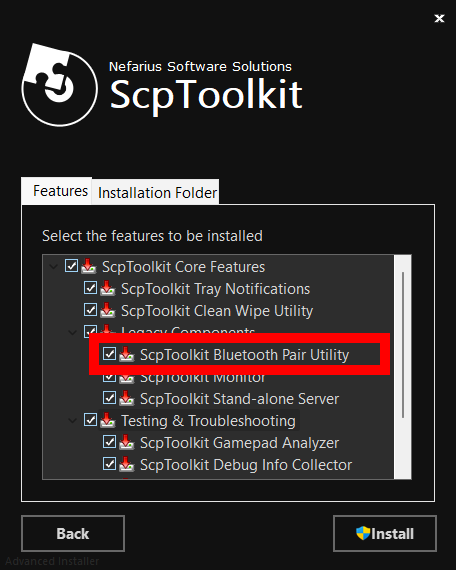

# Connect ESP32 ke Kontroller PS3 KW Super

Repository ini memberikan tutorial cara mengakali koneksi kontroler PS3 yang bisa kamu dapatkan hanya dengan harga 50k di marketplace.  
_(Scam Cik!! Tapi bisa dipakai kalau tahu caranya 😎)_

---

## 🧰 Alat dan Bahan

1. 🎮 Kontroller PS3 **KW Super** yang kamu dapatkan dari marketplace.
2. Kabel Mini USB Buat nyolo psnya ke laptop 
3. 💻 **Arduino IDE**  
   (Pastikan sudah terinstal dan sudah ditambahkan **board ESP32**)
4. 📟 **ESP32**  
   (Gunakan seri yang memiliki **Bluetooth**)
5. 🧰 **SCP Toolkit**  
   Bisa didapatkan di[github ScpToolkit](https://github.com/nefarius/ScpToolkit/releases/tag/v1.7.277.16103-BETA) Kalau windows download .exe aja ya.

   

---
## Setup ESP-32

### 1. Install Librarry PS3 Controller Host by Jeffrey van Pernis
Library ini berguna untuk memudahkan kita melakukan interfacing Bluetooth PS3

### 2. Cek Mac Address Bluetooth ESP-32
Untuk ini kamu bbisa gunakan program berikut :
```cpp
#include <Ps3Controller.h>

void setup()
{
    Serial.begin(115200);
    Ps3.begin();

    String address = Ps3.getAddress();

    Serial.print("The ESP32's Bluetooth MAC address is: ");
    Serial.println(address);
}

void loop()
{

}
```
Nanti bakal keliatan kaya dibawah kalau udah di upload. pastikan buat nginget MACnya catat bila perlu :


### Program Koneksi Ke PS3
Nah tadi kan udah ada suruhan PS3 Controller Host by Jeffrey van Pernis untuk program koneksinya bisa coba pakai program dibawah
```cpp
#include <Ps3Controller.h>

void notify()
{
    if( Ps3.data.button.cross ){
        Serial.println("Pressing the cross button");
    }

    if( Ps3.data.button.square ){
        Serial.println("Pressing the square button");
    }

    if( Ps3.data.button.triangle ){
        Serial.println("Pressing the triangle button");
    }

    if( Ps3.data.button.circle ){
        Serial.println("Pressing the circle button");
    }
}

void onConnect(){
  Serial.println("Connected!.");
}

void setup()
{
    Serial.begin(115200);
    Ps3.attach(notify);
    Ps3.attachOnConnect(onConnect);
    Ps3.begin("78:42:1C:6D:77:B6"); //Ganti MAC Sama MAC Adress ESP kamu
    Serial.println("Ready.");
}

void loop()
{
}
```
Pastiin ganti MACnya ke MAC ESP 32mu ya : )

## Setup Stick PS

### Installasi SCP Toolkit
1. Kalian Jalankan ScpToolkit_Setup.exe dan akan muncul tampilan dibwah. kalian bisa pilih dimana mau install appnya dan bisa di checklist I agree kemuadn press Next


2. Yang perlu kalian install hanya Bluetooth Pait Utility ya, untuk yang lain sebbenarnya tidak perlu. tapi ada baiknnya install semua kan.

