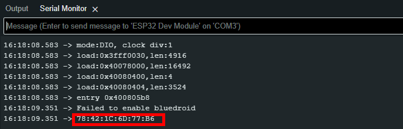

# Connect ESP32 ke Kontroller PS3 KW Super

Repository ini memberikan tutorial cara mengakali koneksi kontroler PS3 yang bisa kamu dapatkan hanya dengan harga 50k di marketplace.  
_(Scam Cik!! Tapi bisa dipakai kalau tahu caranya 😎)_

---

## 🧰 Alat dan Bahan

1. 🎮 Kontroller PS3 **KW Super** yang kamu dapatkan dari marketplace.
2. 💻 **Arduino IDE**  
   (Pastikan sudah terinstal dan sudah ditambahkan **board ESP32**)
3. 📟 **ESP32**  
   (Gunakan seri yang memiliki **Bluetooth**)
4. 🧰 **SCP Toolkit**  
   Bisa didapatkan di: [github ScpToolkit](https://github.com/nefarius/ScpToolkit/releases/tag/v1.7.277.16103-BETA)

---
## Setup ESP-32

### 1. Install Librarry PS3 Controller Host by Jeffrey van Pernis
Library ini berguna untuk memudahkan kita melakukan interfacing Bluetooth PS3

### 2. Cek Mac Address Bluetooth ESP-32
Untuk ini kamu bbisa gunakan program berikut :
```cpp
#include <Ps3Controller.h>

void setup()
{
    Serial.begin(115200);
    Ps3.begin();

    String address = Ps3.getAddress();

    Serial.print("The ESP32's Bluetooth MAC address is: ");
    Serial.println(address);
}

void loop()
{

}
```
Nanti bakal keliatan kaya dibawah kalau udah di upload. pastikan buat nginget MACnya catat bila perlu :


