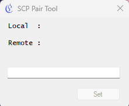
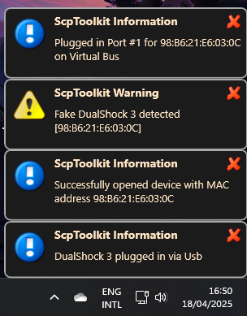
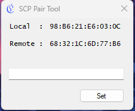
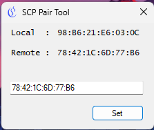
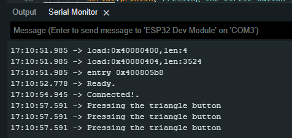

# 🎮 ESP32 + PS3 KW Super Controller

[](https://www.espressif.com/en/products/socs/esp32)
[](https://www.arduino.cc/en/software)
[](LICENSE)

Tutorial ini menunjukkan cara **menghubungkan ESP32 dengan stick PS3 KW Super** — stick 50 ribuan yang kamu temuin di marketplace tapi ternyata bisa dipakai juga kalau tau caranya 😎

> _"Scam Cik, tapi bisa dibikin jalan!"_

---

## 🧭 Table of Contents

- [🧰 Alat dan Bahan](#-alat-dan-bahan)
- [🛠️ Setup Kontroller PS3](#️-setup-kontroller-ps3)
  - [1. Install SCP Toolkit](#1-installasi-scp-toolkit)
  - [2. Pairing MAC Stick ke ESP32](#2-setup-mac-bluetooth-kontroller)
- [⚙️ Setup ESP32](#️-setup-esp32)
  - [1. Install Library PS3](#1-install-library-ps3-controller-host-by-jeffrey-van-pernis)
- [🔌 Program Koneksi ke PS3](#-program-koneksi-ke-ps3)
- [✅ Cek Koneksi](#-cek-koneksi)
- [🏁 Penutup](#-penutup)

---

## 🧰 Alat dan Bahan

- 🎮 Stick PS3 **KW Super** dari marketplace
- 🔌 Kabel Mini USB
- 💻 **Arduino IDE** (plus Board ESP32 sudah ditambahkan)
- 📟 **ESP32** (pastikan ada Bluetooth-nya)
- 🧰 **SCP Toolkit**  
  ➤ [Download dari GitHub](https://github.com/nefarius/ScpToolkit/releases/tag/v1.7.277.16103-BETA)

---
## 🛠️ Setup Kontroller PS3

### 1. Installasi SCP Toolkit

1. Jalankan `ScpToolkit_Setup.exe`
2. Checklist "I agree" dan tekan **Next**  
   
3. Pilih **Bluetooth Pair Utility** (opsional: install semua)  
   

### 2. Setup MAC Bluetooth Kontroller

1. Buka **ScpToolkit Bluetooth Pair Utility (legacy)**  
   

2. Colok stick ke laptop via kabel mini USB  
   💬 Akan muncul notifikasi  
   

3. Di jendela Pairing akan muncul:
   - **Local**: MAC stick PS3
   - **Remote**: MAC target (ESP32 kamu)  
   

   > Jika belum muncul, tekan **PS + Start** di stick

4. Masukkan MAC yang kamu inginkan kamu ke kolom Remote lalu klik **Set**  
   

5. Lepas kabel dari stick.

---
## ⚙️ Setup ESP32

### Install Library PS3 Controller Host by Jeffrey van Pernis

> Cari dan install melalui Library Manager Arduino IDE:  
> PS3 Controller Host by Jeffrey van Pernis`

## 🔌 Program Koneksi ke PS3

Upload kode ini ke ESP32 (ganti MAC sesuai MAC address yang kamu setting di PS3):

```cpp
#include <Ps3Controller.h>

void notify()
{
    if( Ps3.data.button.cross ){
        Serial.println("Pressing the cross button");
    }

    if( Ps3.data.button.square ){
        Serial.println("Pressing the square button");
    }

    if( Ps3.data.button.triangle ){
        Serial.println("Pressing the triangle button");
    }

    if( Ps3.data.button.circle ){
        Serial.println("Pressing the circle button");
    }
}

void onConnect(){
  Serial.println("Connected!.");
}

void setup()
{
    Serial.begin(115200);
    Ps3.attach(notify);
    Ps3.attachOnConnect(onConnect);
    Ps3.begin("78:42:1C:6D:77:B6");     //<--Ganti MAC Disini
    Serial.println("Ready.");
}

void loop()
{
}

```

## ✅ Cek Koneksi

1. Buka Serial Monitor di Arduino IDE
2. Tekan tombol **RST** di ESP32
3. Tekan tombol **PS** di stick PS3

🎉 Kalau berhasil, kamu akan lihat teks seperti ini:


---

## 🏁 Penutup

> **Selamat!** Kamu berhasil menghubungkan stick PS3 KW Super ke ESP32 dengan Bluetooth.

> _"Tidak ada yang tidak mungkin, selama tidak melanggar hukum alam."_

---

## 🪪 Lisensi

Proyek ini menggunakan lisensi [MIT License](LICENSE)

---

```
